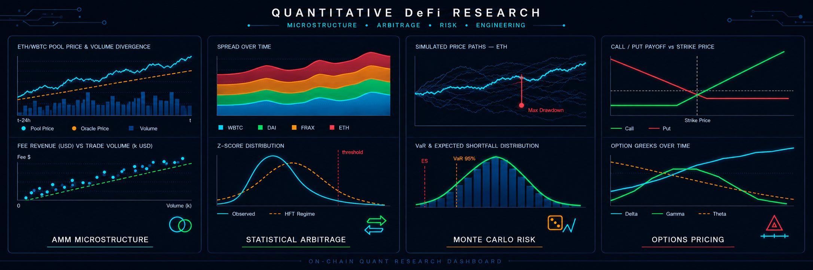

  
  
<em>Click the banner to view the full analysis report</em>

# Module 3: Stochastic Risk Modeling (Monte Carlo)

*This project is **Module 3** of the broader [`Quantitative-DeFi-Research`](../README.md) mega-project.*

## 📖 Overview
In Decentralized Finance (DeFi), lending protocols face severe solvency risks when collateral asset prices decline rapidly. This project engineers a stochastic risk model to quantify the "Tail Risk" of Ethereum (ETH) over a 30-day horizon. By quantifying this risk, protocols can dynamically set Loan-to-Value (LTV) ratios to ensure solvency.

## 🧮 Mathematical Framework (GBM)
To model future price paths, we assume asset prices follow a stochastic process known as Geometric Brownian Motion (GBM):
$$dS_t = \mu S_t dt + \sigma S_t dW_t$$
Where:
*   $\mu$ (Drift): Expected daily return (calibrated to ~0.00%).
*   $\sigma$ (Volatility): Standard deviation of returns (calibrated to ~3.87% daily).
*   $dW_t$: A Wiener process (Random Walk).

## 📊 Results and Analysis
Using $S_0 = \$3,272.79$, the model generated 10,000 unique price paths over 30 days[cite: 9]. 
*   **Value at Risk (VaR):** The 95% VaR was calculated at $2,255.85, meaning we are 95% confident the price of ETH will not fall below this level over the next month.
*   **Liquidation Probability:** For a hypothetical DeFi loan with a liquidation threshold set at $2,290 (a ~30% drop), the simulation recorded insolvency in 587 out of 10,000 paths. 
*   **Conclusion:** A 5.87% probability of mass liquidation implies significant tail risk, requiring dynamic interest rate adjustments.

## 📋 Project Tasks
*   **Calibration:** Calibrate Drift and Volatility from historical ETH data.
*   **Simulation Engine:** Run 10,000 future price paths for ETH using Geometric Brownian Motion (GBM).
*   **Risk Metrics:** Calculate "Value at Risk" (VaR) and Expected Shortfall.
*   **Visualization:** Plot the "Cone of Uncertainty" (Spaghetti Plot) and calculate the probability of breaching liquidation thresholds.

*Bridging the Gap: Having quantified the tail risk in Module 3 and the Impermanent Loss in Module 1, Module 4 designs the financial derivatives (Options) necessary to hedge against these exact risks.*
